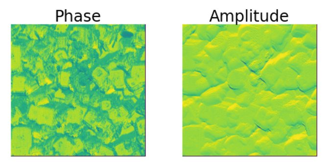
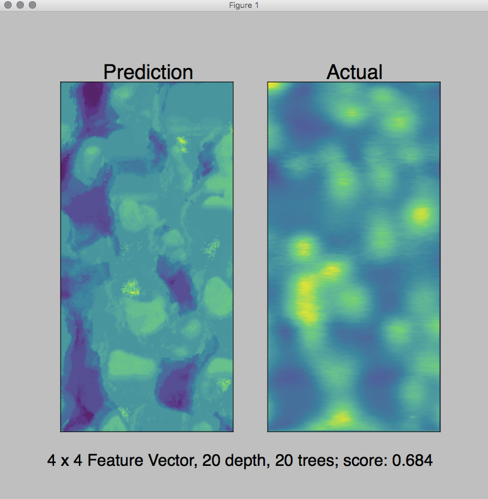
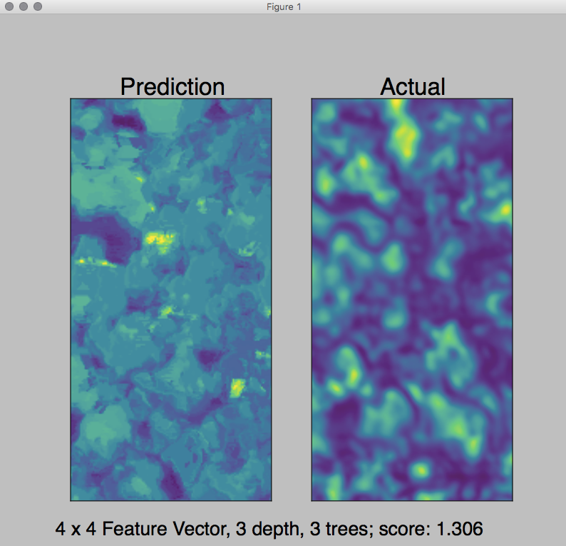

# Project Title: AFM Miner

# Directory Structure 

There are three primary directories: data, images, and notebooks. Data supplies the example data required for unit tests, images and notebooks are directories used for prototyping and development. The directories: notes and numpy files will be discontinued at a later time but are for now home to deprecated development materials. 

within afmMiner are two primary .py files. afmMiner.py contains all source code. afmGUI.py contains the code enabling the GUI and executes code within afmMiner.py

# Usage Instructions

AfmMiner uses **Random Forests**, a kind of non-parametric supervised learning algorithm, to discover materials properties from atomic force microscopy (AFM) images. In particular, afmMiner can predict the photoluminesence of a material given some topographical and electrical AFM data. AfmMiner addresses a fundamental question: **can we predict photoluminescence from things that are not diffraction limited**, and allows the user to uncover relationships between topographical, electrical, and photographic measurements of their material.

**afmMiner, what’s under the hood?** afmMiner uses the sklearn ensemble module RandomForestRegressor to process sets of AFM images and predict non-diffraction limited spatial mapping of the material’s photoluminescence. This ensemble learner trains a number of classifying decision trees on the user’s provided training data (pixels representing the AFM measurements) and averages them to create the final model, example input images are shown below.

 

The afmMiner user has control over tree depth, number of trees, input images, and a final parameter, the “feature vector” that represents the array size of surrounding pixels that are used as inputs to predict the center pixel. This last option was implemented as a way to contextualize a given pixel with its neighbors and reduce the effect of noisey data.

**afmMiner.selfCompare():** selfCompare trains and tests on the same material essentially removing material-specific artifacts that may arise between training and testing sets.

 

**afmMiner.crossCompare():** crossCompare trains and tests on separate materials, given that the AFM input-types are the same. 

 

**GUI Design**. The GUI uses tkinter to display the interface. The window allows users to input the depth of the trees, the number of trees in the forest, the size of the feature vector and the input images to train and test against. Based on the columns used for the inputs, the function will run either selfCompare or crossCompare and output the final prediction. As a result, the user can easily adjust the parameters to find the best model for the images. The images use ‘viridis’ color mapping to differentiate high and low pixel values. 

